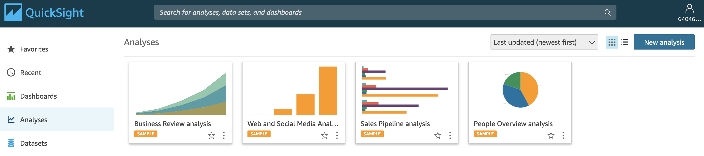
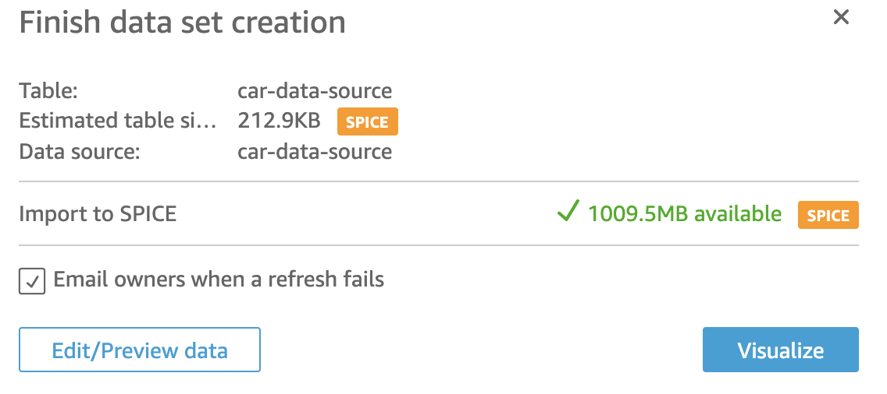
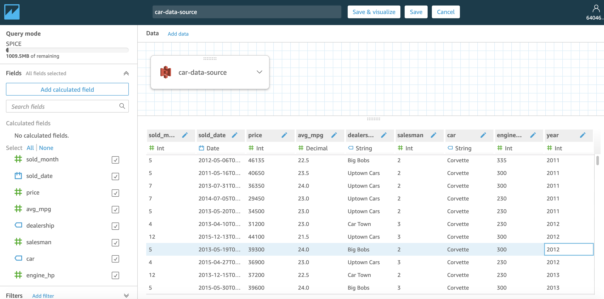
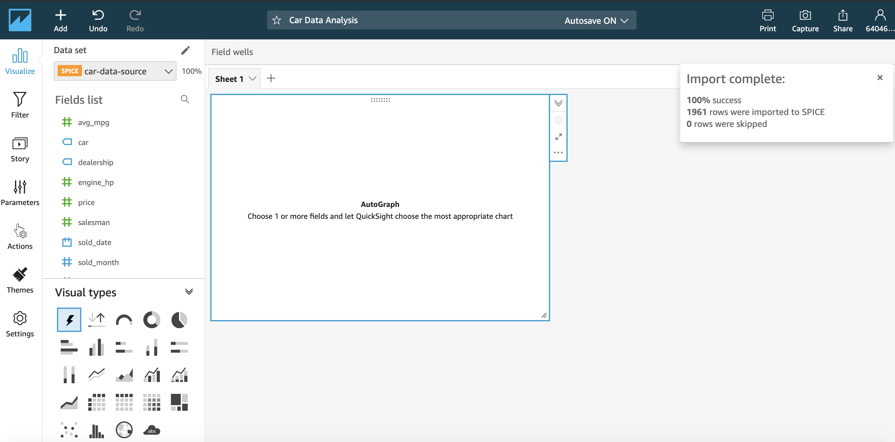
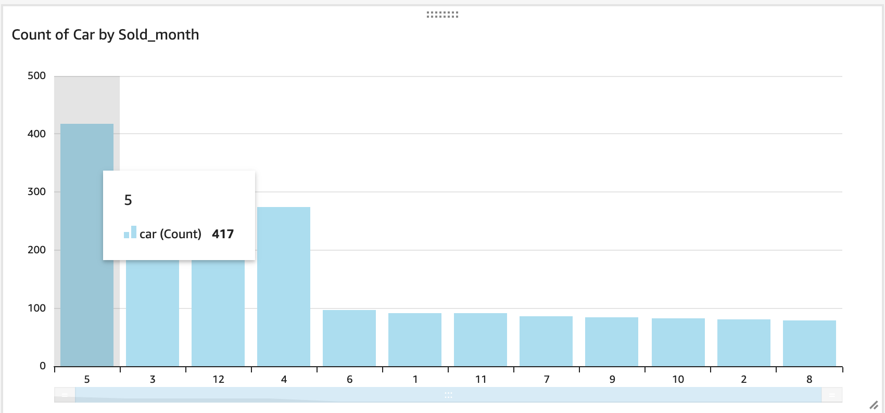
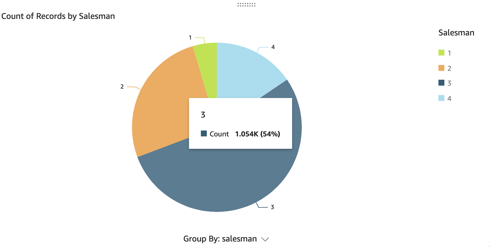
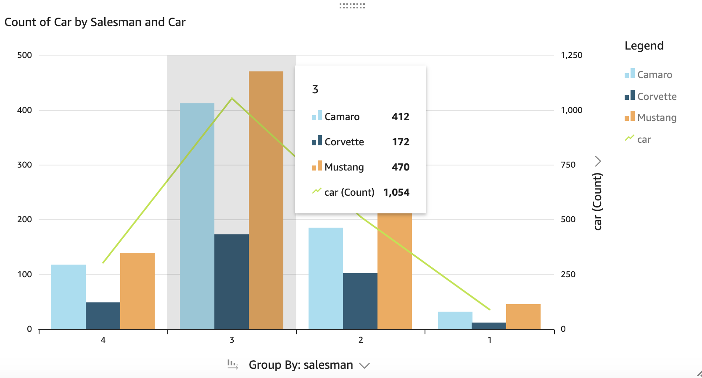
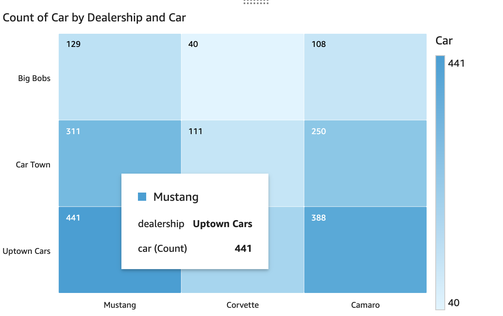
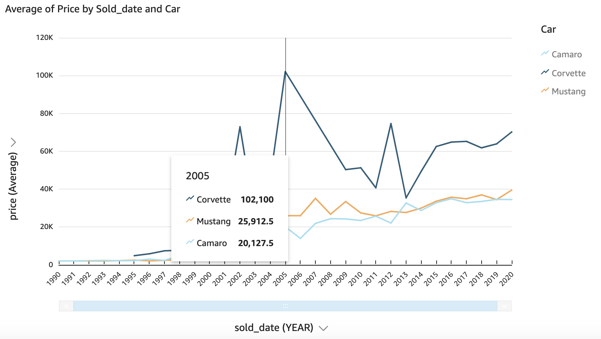

# Data Analysis and Visualization lab

### Use Case
You work for a company that owns several car dealerships.
You've been tasked with analyzing and visualizing data collected about sales to possibly predict future sales.

Which month generates the most sales?
Which car salesman sold the most cars?
Which dealership sold the most cars?
In what year was the average price of a Corvette greater than 100K?
Which car has several points in the box plot's far right upper quartile for the engines horsepower?

### Data Sets
Available here: [car_data.csv](data/car_data.csv)

Sample:
```
car,year,engine_hp,avg_mpg,price,salesman,dealership,sold_date,sold_month
Corvette,2011,335.0,22.5,46135,2,Big Bobs,2012-05-06,5
Corvette,2011,300.0,23.5,40650,2,Uptown Cars,2011-05-16,5
Corvette,2011,300.0,24.0,36350,2,Uptown Cars,2013-07-31,7
Corvette,2011,230.0,23.0,29450,2,Uptown Cars,2014-07-05,7
Corvette,2011,230.0,23.0,34500,2,Uptown Cars,2013-05-20,5
```

### Approach
Use Amazon QuickSight or Jupyter Notebooks to analyze and visualize the data.
1- Quicksight is more "drag and drop"
2- Jupyter is more hands on

#### Approach 1 with Quicksight
So I can get a better feel for this fully managed BI Tool.
I used my personal AWS account as I did not have the IAM role to use Quicksight in the Cloudguru sandbox account.
I uploaded to S3 the dataset: `s3://fab-car/car_data.csv`
=> url: `https://fab-car.s3.amazonaws.com/car_data.csv`

I then used Quicksight service
I had to register and sign up to Quicksight and name it `fabquicksight`
I also had to select "S3" being one of the source and I selected my bucket.
Eventually I got to landing page:



I clicked on `New Analysis`
It provided me with sample datasets. To note datasets are stored in a temporary in memory storage called `SPICE`
I ended up creating a new dataset => select `New Dataset`

Upon selecting S3, I need to provide:
 - Data source name: `car-data-source`
 - Upload a manifest (which describes the file location, what is the format,...) - this file is in json: [my-manifest.json](my-manifest.json)
 Here is how it looks:
 ```
 {
     "fileLocations": [
         {
             "URIPrefixes": [
                 "s3://fab-car/"
             ]
         }
     ],
     "globalUploadSettings": {
         "format": "CSV",
         "delimiter": ",",
         "textqualifier": "'",
         "containsHeader": "true"
     }
 }
 ```

Then I click on: `Connect`


I can then edit/preview the data:


And visualize it:


We can now answer business questions.
Which month generated the most sales?
=> May with 417 cars sold


Which salesman sold the most cars?
=> salesman #3 with over 1k cars sold


What car type was sold the most, by saleaman?
=> Mustang for salesmand #3


What dealer sold the most cars?
=> Uptown Cars


Year that corvette got sold over $100k?
=> 2005


Box plots with Quicksight - will do it with Jupyter libraries...


#### Approach 2 with Jupyter Notebook
Here is the [box-plot notebook](4-data-visualization/box-plot-example.ipynb)
We can launch from SageMaker

Libraries we will be using are:
- `boto3` - amazon sdk to interact with AWS services
- `pandas`
- `get_execution_role` to use the IAM role associated with this notebook
- `maptplotlib` to plot the dataset

We load the data from S3 into a dataframe.

We then split that into 3 smaller dataframes, one per car type (Corvette, Mustang and Camaro). Then we plot that data with the matplotlib.plt function.

We now can answer the business question about upper quartile.
We can see some plots for Mustang, with several cars with a lots of horsepower that is lying outside of the others.
It could be anomalies or outliers.
