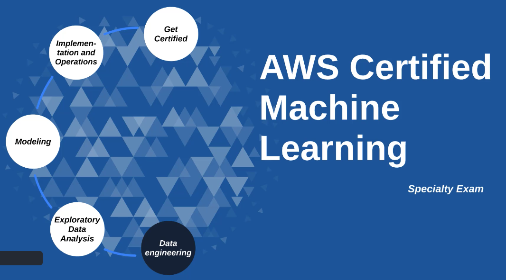

# AWS ML Specialty

This repo includes various courses, white paper, snapshots, notes that helped me pass the [AWS ML Specialty certification](https://aws.amazon.com/certification/certified-machine-learning-specialty/) in 2020.

This repo is not intended to list every resource that exists out there but should help some of my fellow associates to get started with some good documentation.

A bit more about this ML Specialty certification:  
*"The AWS Certified Machine Learning - Specialty certification is intended for individuals who perform a development or data science role. It validates a candidate's ability to design, implement, deploy, and maintain machine learning (ML) solutions for given business problems."*

Topics covered during the exam:
1. **Data Engineering (20%)**: S3 (and VPC Endpoint Gateway), Kinesis (Streams, FireHose, Data Analytics, Video), Glue (Data Catalog and Crawler), Athena, AWS Data Stores (Redshift, RDS/Aurora, DynamoDB, ElasticSearch, ElastiCache), AWS Data Pipelines, AWS Batch, AWS DMS, AWS Step Functions
2. **Exploratory Data Analysis (24%)**:
3. **Modeling (36%)**:
4. **ML Implementations and Operations (20%)**:

### 1. Course and lab

#### 1.1 CloudGuru Course
The [Cloud Guru - AWS Certified Machine Learning - Specialty 2020 Course](https://learn.acloud.guru/course/aws-certified-machine-learning-specialty/dashboard) includes over 17 hours of videos, 79 lessons, 8 course quizzes and 1 practice exam. There are also some great labs to get hands on.

Below are some of my notes/snapshots from the course:
 - [1-data-collection](cloudguru-course/1-data-collection/cloudguru-1-data-collection.pdf)
 - [2-streaming-data-collection](cloudguru-course/2-streaming-data-collection/cloudguru-2-streaming-data-collection.pdf)
 - [3-data-preparation](cloudguru-course/3-data-preparation/cloudguru-3-data-preparation.pdf)
 - [4-data-visualization](cloudguru-course/4-data-visualization/cloudguru-4-data-analysis-visualization.pdf)
 - [5-modeling](cloudguru-course/5-modeling/cloudguru-5-modeling.pdf)
 - [6-algorithms](cloudguru-course/6-algorithms/cloudguru-6-algorithms.pdf)
 - [7-evaluation-optimization](cloudguru-course/7-evaluation-optimization/cloudguru-7-evaluation-and-optimization.pdf)

#####  CloudGuru Lab Work
 - [Data Preparation](3-data-preparation/readme.md)
 - [Data Visualization](4-data-visualization/readme.md)
 - [Modeling](5-modeling/readme.md)
 - [Algorithms](6-algorithms/readme.md)
 - [Evaluation and Optimization](7-evaluation-optimization/readme.md)

#### 1.2 Udemy Course
The [Udemy AWS Certified Machine Learning Specialty 2020 - Hands On! Course](https://www.udemy.com/course/aws-machine-learning/learn/lecture/16368832#overview) includes over 9 hours of videos, 114 lessons and 1 practice exam. The full list of course slides is available [here](udemy-course/udemy-ml-specialty-course-all-slides.pdf).

Below are some of my notes/snapshots from the course:
 - [1-data-engineering (part1)](udemy-course/udemy-ml-specialty-course-1-data-engineering-part1.pdf)
 - [1-data-engineering (part2)](udemy-course/udemy-ml-specialty-course-1-data-engineering-part2.pdf)
 Below are some of my notes/snapshots from the course:
 - [1-data-engineering (part1)](udemy-course/udemy-ml-specialty-course-1-data-engineering-part1.pdf)
 - [1-data-engineering (part2)](udemy-course/udemy-ml-specialty-course-1-data-engineering-part2.pdf)
 - [2-exploratory-data-analysis)](udemy-course/udemy-ml-specialty-course-2-exploratory-data-analysis.pdf)
 - [2-exploratory-data-analysis (lab))](udemy-course/udemy-ml-specialty-course-2-exploratory-data-analysis-lab.pdf)
 - [3-modeling-concepts](udemy-course/udemy-ml-specialty-course-3-modeling-concepts.pdf)
 - [3-modeling-ml-services (part1)](udemy-course/udemy-ml-specialty-course-3-ml-services-part1.pdf)
 - [3-modeling-ml-services (part2)](udemy-course/udemy-ml-specialty-course-3-ml-services-part2.pdf)
 - [3-modeling-ai-services](udemy-course/udemy-ml-specialty-course-3-ai-services.pdf)
 - [3-modeling-lab](udemy-course/udemy-ml-specialty-course-3-modeling-lab.pdf)

#### 1.3 AWS Course
- [Linear and Logistic Regression](aws-course/aws-course-linear-logistic-regression.pdf)
 - [aws video](https://www.aws.training/Details/eLearning?id=26599)

- [The Elements of Data Science - part 1](aws-course/aws-course-elements-data-science-part1.pdf)
- [The Elements of Data Science - part 2](aws-course/aws-course-elements-data-science-part2.pdf)
- [The Elements of Data Science - part 3](aws-course/aws-course-elements-data-science-part3.pdf)
- [The Elements of Data Science - part 4](aws-course/aws-course-elements-data-science-part4.pdf)

#### 1.4 AWS White Papers
- [Deep Learning on AWS - pdf extract](aws-whitepaper/aws-white-paper-deep-learning.pdf)
 - [Full white paper](https://d1.awsstatic.com/whitepapers/Deep_Learning_on_AWS.pdf?did=wp_card&trk=wp_card)
- [AWS White Paper - Machine Learning Foundations - pdf extract](aws-whitepaper/aws-white-paper-machine-learning-foundations.pdf)
 - [Full white paper](https://d1.awsstatic.com/whitepapers/machine-learning-foundations.pdf)
- [AWS White Paper - Power Machine Learning at Scale - pdf extract](aws-whitepaper/aws-white-paper-power-machine-learning-at-scale.pdf)
 - [Full white paper](https://d1.awsstatic.com/whitepapers/aws-power-ml-at-scale.pdf?did=wp_card&trk=wp_card)
- [AWS White Paper - Streaming Data Solutions on AWS with Amazon Kinesis - pdf extract](aws-whitepaper/aws-white-paper-streaming-data-solutions-kinesis.pdf)
 - [Full white paper](https://d0.awsstatic.com/whitepapers/whitepaper-streaming-data-solutions-on-aws-with-amazon-kinesis.pdf)
)

#### 1.5 AWS FAQ

- [AWS FAQ - pdf extract](aws-faq/aws-faq.pdf)
 - [Full FAQ Link](https://aws.amazon.com/sagemaker/faqs/)

### 2. Practice Exams

#### 2.1 CloudGuru
passed on 10/18/2020: scored 75% and used 1h35 from the 3 hours to cover the 65 questions
- [cloudguru practice exam - part 1](exam-readiness/cloudguru-exam-readiness/cloudguru-practice-exam-part-1.pdf)
- [cloudguru practice exam - part 2](exam-readiness/cloudguru-exam-readiness/cloudguru-practice-exam-part-2.pdf)
- [cloudguru practice exam - review](exam-readiness/cloudguru-exam-readiness/cloudguru-practice-exam-review.pdf)

#### 2.2 AWS
- [aws sample exam questions](exam-readiness/aws-exam-readiness/aws-ml-sample-exam-questions-oct2020.pdf)
- [aws exam readiness - certified ml specialty](exam-readiness/aws-exam-readiness/aws-exam-readiness-certified-ml-specialty.pdf)
- [aws exam readiness - domain1 - data engineering -](exam-readiness/aws-exam-readiness/aws-exam-readiness-domain1-data-engineering.pdf)
- [aws exam readiness - domain2 - exploratory data analysis](exam-readiness/aws-exam-readiness/aws-exam-readiness-domain2-exploratory-data-analysis.pdf)
- [aws exam readiness - domain3 - modeling](exam-readiness/aws-exam-readiness/aws-exam-readiness-domain3-modeling.pdf)
- [aws exam readiness - domain4 - ml implementation operations.pdf](exam-readiness/aws-exam-readiness/aws-exam-readiness-domain4-mlimplementation-operations.pdf)
- [aws exam readiness - study questions](exam-readiness/aws-exam-readiness/aws-exam-readiness-study-questions.pdf)
- [aws exam readiness - study results](exam-readiness/aws-exam-readiness/aws-exam-readiness-study-questions-results.pdf)

#### 2.3 Misc
- [additional exam notes](exam-readiness/additional-notes-practice-exam.pdf)

### Resources
 - [A Cloud Guru - ML Specialty Course](https://acloud.guru/learn/aws-certified-machine-learning-specialty)
 - [A Cloud guru AWS Certification prep](https://acloud.guru/learn/aws-certification-preparation)
 - [A Cloud Guru Labs - Github](https://github.com/ACloudGuru-Resources/Course_AWS_Certified_Machine_Learning)
 - [AWS Training and Certification](https://www.aws.training/) - this is where you can pass the `Exam Readiness` course and quiz
 - [Amazon SageMaker Developer guide](https://docs.aws.amazon.com/sagemaker/latest/dg/sagemaker-dg.pdf)
